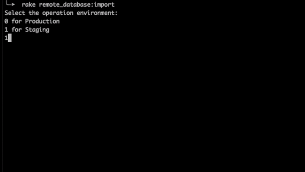
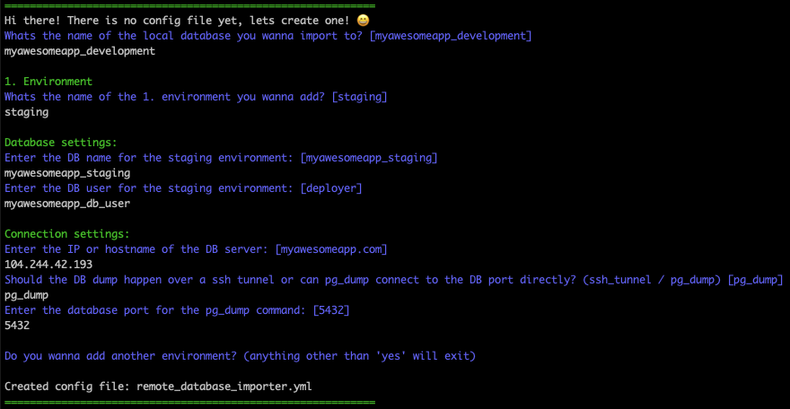

# RemoteDatabaseImporter
**RemoteDatabaseImporter** is a small gem with one specific reason to exist: Dump remote databases and import it locally.

**This gem is currently in beta phase!**  
Its well possible that unexpected errors can occur.

## Features
- Define multiple environments (such as staging, production etc.)
- Rails intergration via rake task
- Decide for yourself if the dump should be done over ssh or if pg_dump should connect to the DB port directly
- It can therefore be used for almost all hosting providers (Heroku, Kubernetes, self-hosted, etc.)

## Installation

Add this line to your application's gemfile:

```ruby
gem 'remote_database_importer'
```

And then execute:

    $ bundle install

Or install it yourself as:

    $ gem install remote_database_importer

## Usage
Whenever you want current live data, you can run the command:

```ruby
rake remote_database:import
```



### Config
The settings for the different environments is stored in the `remote_database_importer.yml` file.  
When you first run the rake task, it will dynamically create this file for you.




### DB Access
The easiest and fastest way is to exchange your ssh-key with the server beforehand, so you don't have to enter a password.  
Otherwise during the rake task execution a password entry is required.

The effective dump call is as follows:
```ruby
"ssh SSH_USER@HOST -p SSH_PORT 'pg_dump -Fc -U DB_USER -d DB_NAME -h localhost -C' > DB_DUMP_LOCATION"
or
"pg_dump -Fc 'host=HOST dbname=DB_NAME user=DB_USER port=POSTGRES_PORT' > DB_DUMP_LOCATION"
```

## Limitations
- At the moment only Postgres databases are supported
- It has to run inside a Rails app.
- Not suitable for very large databases, you could run into SSH timeouts

## Contributing

Bug reports and pull requests are very welcome!

## License

The gem is available as open source under the terms of the [MIT License](https://opensource.org/licenses/MIT).
